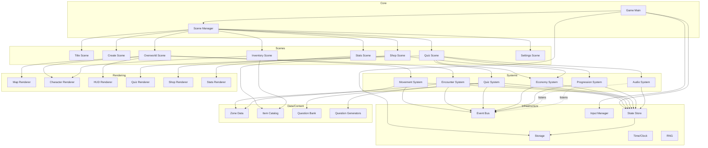
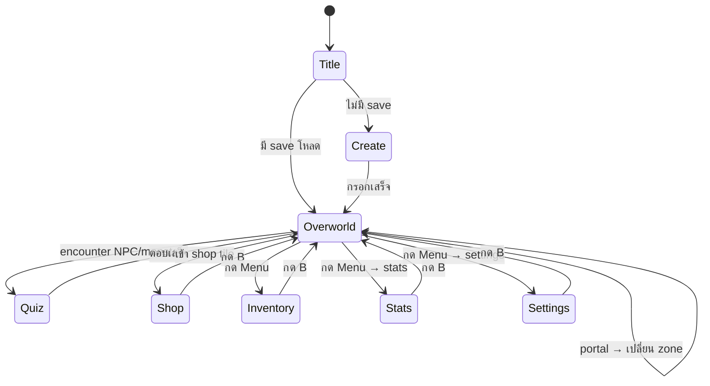
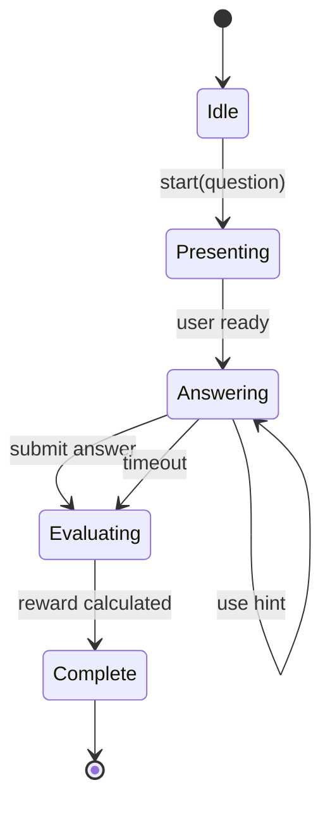
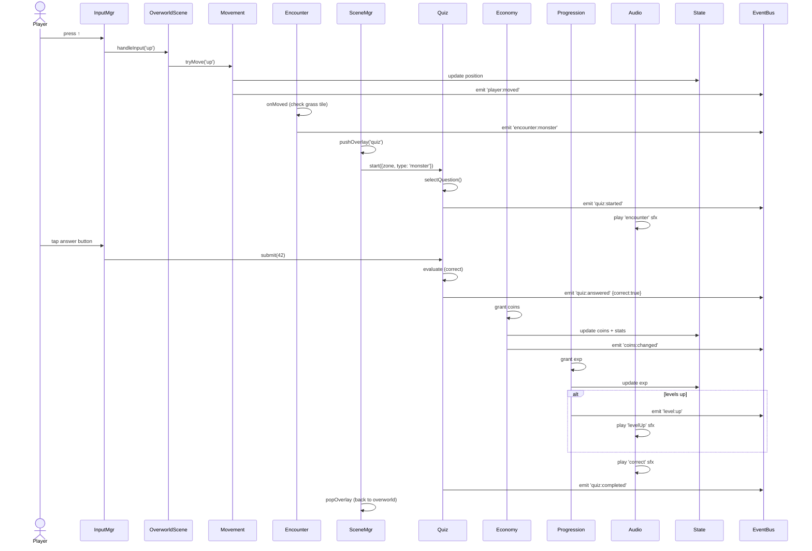
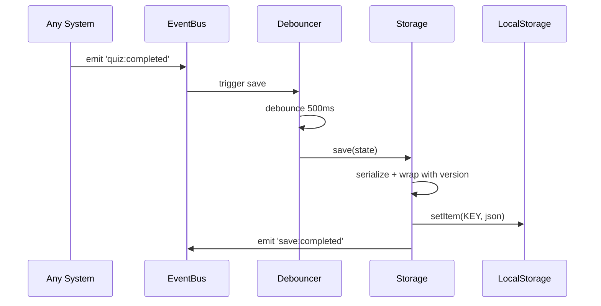
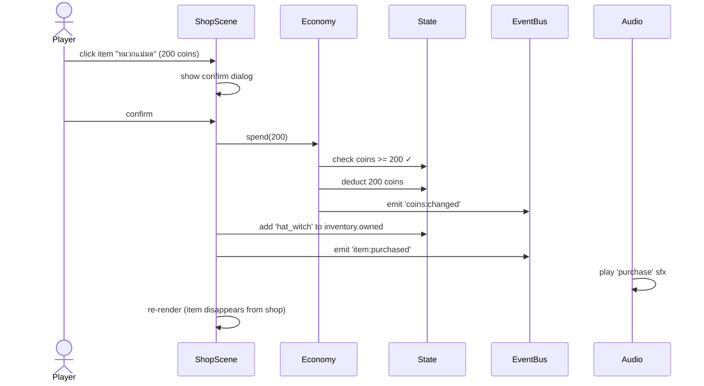

# System Design: Math Adventure Game

**Version:** 1.0  
**Target:** Static web (HTML/CSS/vanilla JS, localStorage only)  
**Complement to:** `math_adventure_spec.md`

---

## Table of Contents

1. [Architectural Overview](#1-architectural-overview)
2. [Module Organization & Dependency Graph](#2-module-organization--dependency-graph)
3. [Namespace & Module Pattern](#3-namespace--module-pattern)
4. [Core Infrastructure Layer](#4-core-infrastructure-layer)
5. [State Management](#5-state-management)
6. [Event Bus](#6-event-bus)
7. [Scene State Machine](#7-scene-state-machine)
8. [Game Loop](#8-game-loop)
9. [Input System](#9-input-system)
10. [Rendering System](#10-rendering-system)
11. [Quiz Engine](#11-quiz-engine)
12. [Storage Layer](#12-storage-layer)
13. [Audio System](#13-audio-system)
14. [Data Contracts (JSDoc Types)](#14-data-contracts-jsdoc-types)
15. [Key Sequence Diagrams](#15-key-sequence-diagrams)
16. [File Structure (Detailed)](#16-file-structure-detailed)
17. [Initialization Sequence](#17-initialization-sequence)
18. [Error Handling & Resilience](#18-error-handling--resilience)
19. [Performance Considerations](#19-performance-considerations)
20. [Testing Strategy](#20-testing-strategy)

---

## 1. Architectural Overview

### 1.1 High-level Layers

```
┌─────────────────────────────────────────────────────────────┐
│                     PRESENTATION LAYER                       │
│  (Renderers: Map, Character, HUD, Quiz, Shop, Stats, etc.)  │
└─────────────────────────────────────────────────────────────┘
                             ▲
                             │ reads state, emits UI events
                             ▼
┌─────────────────────────────────────────────────────────────┐
│                      APPLICATION LAYER                       │
│   (Scenes: Title, Overworld, Quiz, Shop, Inventory, etc.)   │
└─────────────────────────────────────────────────────────────┘
                             ▲
                             │ uses
                             ▼
┌─────────────────────────────────────────────────────────────┐
│                      DOMAIN / SYSTEMS LAYER                  │
│ (Movement, Encounter, Quiz, Economy, Progression, Audio)    │
└─────────────────────────────────────────────────────────────┘
                             ▲
                             │ uses
                             ▼
┌─────────────────────────────────────────────────────────────┐
│                    INFRASTRUCTURE LAYER                      │
│        (State, EventBus, Storage, Input, Time, Random)      │
└─────────────────────────────────────────────────────────────┘
```

**เปรียบเทียบกับ .NET:** คิดแบบ Clean Architecture แต่ simplified — infrastructure layer = "utilities", systems layer = "application services", scenes = "use cases / pages", renderers = "views".

### 1.2 Architectural Principles

| หลักการ | วิธีการ |
|---|---|
| **Unidirectional data flow** | State เปลี่ยนใน systems → renderers อ่าน state → render UI |
| **Single source of truth** | มี `State` กลางเพียงที่เดียว ทุก module อ่าน/เขียนผ่านมัน |
| **Decoupling via event bus** | Systems ไม่รู้จักกันตรงๆ สื่อสารผ่าน `EventBus` |
| **Pure render functions** | Renderer รับ state → return SVG string (ทดสอบได้ง่าย) |
| **Scene as state machine** | ณ เวลาใดเวลาหนึ่งมี active scene 1 ตัว (± overlay) |
| **Separation of concerns** | Logic, rendering, input, storage แยกไฟล์กัน |
| **No magic** | ไม่มี build step, ไม่มี DI container, เรียก function ตรงๆ |

### 1.3 Key Design Decisions

| Decision | เลือก | เหตุผล |
|---|---|---|
| Module system | **IIFE + Global namespace** (`Game.*`) | ES Modules ใช้จาก `file://` ไม่ได้เสมอไป (CORS) |
| State | **Single observable store** | ง่าย, predictable, debuggable ผ่าน console |
| Inter-module comm | **Event bus (pub/sub)** | Decouple systems, ทดสอบง่าย |
| Rendering | **Full re-render per frame** ส่วนที่เปลี่ยน | SVG เล็ก performance เพียงพอ, ไม่ต้องจัดการ diffing |
| Async | **ไม่มี async จริงจัง** (ใช้ requestAnimationFrame) | ไม่ใช้ fetch, ไม่มีไฟล์โหลดภายนอก |
| Type safety | **JSDoc types** | ได้ IntelliSense ใน VS Code โดยไม่ต้องใช้ TypeScript |

---

## 2. Module Organization & Dependency Graph



**กฎสำคัญ:**
- **Scenes** คือ composition layer — ประกอบ systems + renderers
- **Systems** เขียน state, emit events, แต่ **ไม่ render**
- **Renderers** อ่าน state, return HTML/SVG string, **ไม่เขียน state**
- **Infrastructure** ไม่ depend บน systems/scenes (dependency rule)

---

## 3. Namespace & Module Pattern

### 3.1 Pattern (เหมือน C# static class)

ทุกไฟล์ JS ใช้ **Revealing Module Pattern** บน namespace `Game`:

```js
// js/systems/movement.js
window.Game = window.Game || {};
Game.Systems = Game.Systems || {};

Game.Systems.Movement = (function () {
  'use strict';

  // === private ===
  const TILE_SIZE = 32;

  function canWalkTo(zone, x, y) {
    // ...
  }

  // === public API ===
  function tryMove(direction) {
    const state = Game.State.get();
    const { x, y } = state.world.position;
    // ... compute new position
    if (canWalkTo(state.world.currentZone, newX, newY)) {
      Game.State.update(s => ({ ...s, world: { ...s.world, position: { x: newX, y: newY } } }));
      Game.EventBus.emit('player:moved', { x: newX, y: newY });
    }
  }

  return Object.freeze({
    tryMove
  });
})();
```

### 3.2 โหลดผ่าน `<script>` ตามลำดับ

ต้องโหลดตาม dependency order (infrastructure ก่อน, scenes หลังสุด):

```html
<!-- infrastructure -->
<script src="js/infra/event-bus.js"></script>
<script src="js/infra/state.js"></script>
<script src="js/infra/storage.js"></script>
<script src="js/infra/input.js"></script>
<script src="js/infra/rng.js"></script>

<!-- data -->
<script src="js/data/zones.js"></script>
<script src="js/data/items.js"></script>
<script src="js/data/quiz-bank.js"></script>
<script src="js/data/quiz-generators.js"></script>

<!-- systems -->
<script src="js/systems/movement.js"></script>
<script src="js/systems/encounter.js"></script>
<script src="js/systems/quiz.js"></script>
<script src="js/systems/economy.js"></script>
<script src="js/systems/progression.js"></script>
<script src="js/systems/audio.js"></script>

<!-- renderers -->
<script src="js/render/svg-primitives.js"></script>
<script src="js/render/map-renderer.js"></script>
<script src="js/render/character-renderer.js"></script>
<script src="js/render/hud-renderer.js"></script>
<script src="js/render/quiz-renderer.js"></script>
<script src="js/render/shop-renderer.js"></script>
<script src="js/render/inventory-renderer.js"></script>
<script src="js/render/stats-renderer.js"></script>

<!-- scenes -->
<script src="js/scenes/scene-base.js"></script>
<script src="js/scenes/title-scene.js"></script>
<script src="js/scenes/create-scene.js"></script>
<script src="js/scenes/overworld-scene.js"></script>
<script src="js/scenes/quiz-scene.js"></script>
<script src="js/scenes/shop-scene.js"></script>
<script src="js/scenes/inventory-scene.js"></script>
<script src="js/scenes/stats-scene.js"></script>
<script src="js/scenes/settings-scene.js"></script>

<!-- entry -->
<script src="js/scene-manager.js"></script>
<script src="js/main.js"></script>
```

---

## 4. Core Infrastructure Layer

### 4.1 `Game.State` — Observable Store

```js
Game.State = (function () {
  let state = null;
  const listeners = new Set();

  function init(initial) {
    state = deepFreeze(initial);
  }

  function get() {
    return state;
  }

  function update(updater) {
    const next = updater(state);
    if (next !== state) {
      const prev = state;
      state = deepFreeze(next);
      listeners.forEach(fn => fn(state, prev));
    }
  }

  function subscribe(fn) {
    listeners.add(fn);
    return () => listeners.delete(fn);
  }

  return { init, get, update, subscribe };
})();
```

**Key properties:**
- **Immutable by convention** (deep freeze ใน dev; bypass ใน prod ถ้าต้องการ perf)
- **Observer pattern** — renderers subscribe เพื่อ re-render เมื่อ state เปลี่ยน
- **Functional updater** — ลดโอกาส mutation accidental
- **Single tree** — ไม่มี state กระจาย (เปรียบเทียบ: React `useReducer` หรือ Redux store)

### 4.2 `Game.EventBus` — Pub/Sub

```js
Game.EventBus = (function () {
  const handlers = new Map(); // event -> Set<fn>

  function on(event, fn) {
    if (!handlers.has(event)) handlers.set(event, new Set());
    handlers.get(event).add(fn);
    return () => handlers.get(event).delete(fn);
  }

  function emit(event, payload) {
    const set = handlers.get(event);
    if (set) set.forEach(fn => {
      try { fn(payload); } catch (e) { console.error(`[EventBus] ${event} handler error`, e); }
    });
  }

  function clear() { handlers.clear(); }

  return { on, emit, clear };
})();
```

### 4.3 Event Catalog (ทั้งหมดในเกม)

| Event | Payload | ผู้ emit | ผู้ listen |
|---|---|---|---|
| `player:moved` | `{x, y}` | MovementSystem | EncounterSystem, AudioSystem |
| `player:zone_changed` | `{fromZone, toZone}` | MovementSystem | SceneManager, State saver |
| `encounter:npc` | `{npcId}` | EncounterSystem | SceneManager |
| `encounter:monster` | `{monsterType, zone}` | EncounterSystem | SceneManager |
| `quiz:started` | `{question}` | QuizSystem | QuizScene, AudioSystem |
| `quiz:answered` | `{correct, timeTaken, usedHint}` | QuizSystem | Economy, Progression, AudioSystem, Stats |
| `quiz:completed` | `{reward}` | QuizSystem | SceneManager |
| `coins:changed` | `{delta, total}` | EconomySystem | HUDRenderer, AudioSystem |
| `exp:gained` | `{delta, total}` | ProgressionSystem | HUDRenderer |
| `level:up` | `{newLevel}` | ProgressionSystem | AudioSystem, SceneManager (show anim) |
| `zone:unlocked` | `{zoneId}` | ProgressionSystem | AudioSystem, SceneManager (show anim) |
| `item:purchased` | `{itemId, price}` | EconomySystem | Inventory, AudioSystem |
| `item:equipped` | `{slot, itemId}` | Inventory action | CharacterRenderer |
| `save:requested` | `-` | หลาย system | Storage |
| `save:completed` | `{timestamp}` | Storage | (log only) |
| `scene:change` | `{to, params}` | Scenes | SceneManager |
| `input:action` | `{action}` | InputManager | Active scene |

### 4.4 `Game.Storage` — Save/Load

```js
Game.Storage = (function () {
  const KEY = 'math_adventure_save';
  const VERSION = '1.0';

  function save(state) {
    try {
      const payload = {
        version: VERSION,
        savedAt: Date.now(),
        data: state
      };
      localStorage.setItem(KEY, JSON.stringify(payload));
      Game.EventBus.emit('save:completed', { timestamp: payload.savedAt });
      return true;
    } catch (e) {
      console.error('[Storage] save failed', e);
      return false;
    }
  }

  function load() {
    try {
      const raw = localStorage.getItem(KEY);
      if (!raw) return null;
      const payload = JSON.parse(raw);
      return migrate(payload);
    } catch (e) {
      console.error('[Storage] load failed', e);
      return null;
    }
  }

  function migrate(payload) {
    if (payload.version === VERSION) return payload.data;
    // เพิ่ม migration logic ที่นี่เมื่อ version เปลี่ยน
    return payload.data;
  }

  function clear() { localStorage.removeItem(KEY); }
  function exists() { return localStorage.getItem(KEY) !== null; }

  return { save, load, clear, exists };
})();
```

**Auto-save strategy (throttled):**
```js
// ใน main.js
let saveTimer = null;
const TRIGGERS = ['quiz:completed', 'item:purchased', 'item:equipped', 'player:zone_changed'];
TRIGGERS.forEach(ev => Game.EventBus.on(ev, () => {
  clearTimeout(saveTimer);
  saveTimer = setTimeout(() => Game.Storage.save(Game.State.get()), 500); // debounce
}));

// ตอนเดิน save ทุก 30 วิ
setInterval(() => Game.Storage.save(Game.State.get()), 30000);
```

---

## 5. State Management

### 5.1 Root State Shape

```js
/**
 * @typedef {Object} RootState
 * @property {string} version
 * @property {PlayerState} player
 * @property {WorldState} world
 * @property {InventoryState} inventory
 * @property {string[]} npcsCompleted
 * @property {string[]} bossDefeated
 * @property {StatsState} stats
 * @property {SettingsState} settings
 * @property {UIState} ui
 */
```

### 5.2 State Slices

```js
/**
 * @typedef {Object} PlayerState
 * @property {string} name
 * @property {'male'|'female'} gender
 * @property {number} level       // 1..N
 * @property {number} exp         // current EXP toward next level
 * @property {number} coins
 */

/**
 * @typedef {Object} WorldState
 * @property {ZoneId} currentZone
 * @property {{x: number, y: number}} position
 * @property {ZoneId[]} unlockedZones
 * @property {'up'|'down'|'left'|'right'} facing
 */

/**
 * @typedef {Object} InventoryState
 * @property {string[]} owned
 * @property {{
 *   hat: string|null,
 *   clothes: string|null,
 *   shoes: string|null,
 *   accessory: string|null,
 *   glasses: string|null
 * }} equipped
 */

/**
 * @typedef {Object} StatsState
 * @property {number} totalPlayTimeMs
 * @property {Record<TopicId, {correct:number, total:number}>} correctByTopic
 * @property {number} totalCoinsEarned
 * @property {number} totalCoinsSpent
 * @property {number} hintsUsed
 * @property {number} sessionsPlayed
 */

/**
 * @typedef {Object} SettingsState
 * @property {boolean} typingMode
 * @property {boolean} soundEnabled
 * @property {number}  timerMultiplier   // 0.5..2.0 (accessibility)
 */

/**
 * @typedef {Object} UIState
 * @property {SceneId} currentScene
 * @property {SceneId|null} overlayScene
 * @property {Object|null} sceneParams
 */
```

### 5.3 State Update Patterns

**A) Shallow update สำหรับ slice เดียว**
```js
Game.State.update(s => ({ ...s, player: { ...s.player, coins: s.player.coins + 5 } }));
```

**B) Helper สำหรับ nested update (แนะนำทำ helper กลาง)**
```js
Game.State.updateSlice = function(path, updater) {
  // path = 'player.coins', updater = (v) => v + 5
  // ... implement with path parsing
};
Game.State.updateSlice('player.coins', c => c + 5);
```

**C) Batch update หลายส่วน (หลัง quiz)**
```js
Game.State.update(s => ({
  ...s,
  player: {
    ...s.player,
    coins: s.player.coins + reward.coins,
    exp: s.player.exp + reward.exp
  },
  stats: {
    ...s.stats,
    correctByTopic: {
      ...s.stats.correctByTopic,
      [topic]: {
        correct: s.stats.correctByTopic[topic].correct + (correct ? 1 : 0),
        total: s.stats.correctByTopic[topic].total + 1
      }
    }
  }
}));
```

---

## 6. Event Bus

*(ดู section 4.2 + 4.3)*

**Best practices:**
- Event name format: `domain:action` (เช่น `player:moved`, `quiz:answered`)
- Payload ต้องเป็น plain object (ไม่มี class instance)
- Handler ต้องสั้นและไม่ throw (ถ้า throw → swallowed)
- อย่า emit event ใน state subscription callback (infinite loop risk)

---

## 7. Scene State Machine

### 7.1 Scene Interface

ทุก scene implement interface เดียวกัน:

```js
/**
 * @typedef {Object} Scene
 * @property {string} id
 * @property {(params?: any) => void} enter       // เรียกครั้งเดียวตอนเข้า scene
 * @property {() => void} exit                    // เรียกตอนออก (cleanup)
 * @property {(dt: number) => void} update        // เรียกทุก frame (ถ้ามี game loop active)
 * @property {() => string} render                 // return HTML/SVG string
 * @property {(action: InputAction) => void} handleInput
 */
```

### 7.2 Scene Manager

```js
Game.SceneManager = (function () {
  const scenes = {};
  let current = null;
  let overlay = null;      // สำหรับ dialog/quiz ที่ทับ scene เดิม
  const unsubscribers = [];

  function register(scene) { scenes[scene.id] = scene; }

  function goTo(id, params) {
    if (current) { current.exit(); }
    unsubscribers.forEach(u => u());
    unsubscribers.length = 0;

    current = scenes[id];
    if (!current) throw new Error(`Scene not found: ${id}`);
    current.enter(params);

    Game.State.update(s => ({
      ...s,
      ui: { ...s.ui, currentScene: id, sceneParams: params || null }
    }));

    requestRender();
  }

  function pushOverlay(id, params) {
    overlay = scenes[id];
    overlay.enter(params);
    Game.State.update(s => ({ ...s, ui: { ...s.ui, overlayScene: id } }));
    requestRender();
  }

  function popOverlay() {
    if (overlay) { overlay.exit(); overlay = null; }
    Game.State.update(s => ({ ...s, ui: { ...s.ui, overlayScene: null } }));
    requestRender();
  }

  function requestRender() {
    const root = document.getElementById('app');
    const base = current ? current.render() : '';
    const over = overlay ? `<div class="overlay">${overlay.render()}</div>` : '';
    root.innerHTML = base + over;
  }

  function handleInput(action) {
    if (overlay && overlay.handleInput) overlay.handleInput(action);
    else if (current && current.handleInput) current.handleInput(action);
  }

  return { register, goTo, pushOverlay, popOverlay, requestRender, handleInput };
})();
```

### 7.3 Scene Transition Diagram



**หมายเหตุ:** Quiz, Dialog ใช้ `pushOverlay` ไม่ใช่ `goTo` เพราะ overworld ยังอยู่ข้างหลัง

---

## 8. Game Loop

### 8.1 Loop Architecture

```js
Game.Loop = (function () {
  let running = false;
  let lastTime = 0;

  function start() {
    running = true;
    lastTime = performance.now();
    requestAnimationFrame(tick);
  }

  function stop() { running = false; }

  function tick(now) {
    if (!running) return;
    const dt = Math.min(now - lastTime, 100); // clamp เพื่อไม่ให้ dt โตเกิน (tab ถูก throttle)
    lastTime = now;

    // 1. Update active scene
    const active = Game.SceneManager.getActive();
    if (active && active.update) active.update(dt);

    // 2. Update play time stat
    Game.State.update(s => ({
      ...s,
      stats: { ...s.stats, totalPlayTimeMs: s.stats.totalPlayTimeMs + dt }
    }));

    requestAnimationFrame(tick);
  }

  return { start, stop };
})();
```

### 8.2 Render Strategy: Event-driven, ไม่ใช่ per-frame

เนื่องจาก UI เปลี่ยนแปลงไม่บ่อย (คนไม่ได้เดินตลอด) → **re-render เฉพาะเมื่อ state เปลี่ยน** ดีกว่า

```js
// main.js
Game.State.subscribe(() => {
  Game.SceneManager.requestRender();
});
```

ข้อยกเว้น: **overworld** ที่ต้อง animate ตัวละคร/monster — อาจทำ `requestAnimationFrame` แยกเฉพาะ overworld scene โดยอัพเดท transform/position ผ่าน CSS ตรงๆ (ไม่ต้อง re-render DOM ทั้งหมด)

---

## 9. Input System

### 9.1 Unified Input Abstraction

รองรับ keyboard + touch + on-screen button buttons → แปลงเป็น **action** เดียวกัน:

```js
/**
 * @typedef {'up'|'down'|'left'|'right'|'confirm'|'cancel'|'menu'} InputAction
 */

Game.Input = (function () {
  const KEY_MAP = {
    'ArrowUp': 'up',    'w': 'up',    'W': 'up',
    'ArrowDown': 'down','s': 'down',  'S': 'down',
    'ArrowLeft': 'left','a': 'left',  'A': 'left',
    'ArrowRight':'right','d':'right', 'D': 'right',
    'Enter': 'confirm', 'z': 'confirm','Z': 'confirm',
    'Escape':'cancel',  'x': 'cancel', 'X': 'cancel',
    'm': 'menu',        'M': 'menu'
  };

  function init() {
    window.addEventListener('keydown', onKeyDown);
    bindOnScreenButtons();
  }

  function onKeyDown(e) {
    const action = KEY_MAP[e.key];
    if (action) {
      e.preventDefault();
      dispatch(action);
    }
  }

  function bindOnScreenButtons() {
    document.querySelectorAll('[data-action]').forEach(btn => {
      const action = btn.dataset.action;
      // ใช้ pointerdown เพื่อรองรับทั้ง mouse + touch
      btn.addEventListener('pointerdown', (e) => {
        e.preventDefault();
        dispatch(action);
      });
    });
  }

  function dispatch(action) {
    Game.EventBus.emit('input:action', { action });
    Game.SceneManager.handleInput(action);
  }

  return { init };
})();
```

### 9.2 Input Debounce (สำหรับเดิน)

ป้องกันผู้เล่นกดค้างแล้วเดินเร็วเกินไป:

```js
// ใน MovementSystem หรือ OverworldScene
const WALK_COOLDOWN_MS = 150;
let lastWalkAt = 0;

function handleInput(action) {
  if (['up','down','left','right'].includes(action)) {
    const now = performance.now();
    if (now - lastWalkAt < WALK_COOLDOWN_MS) return;
    lastWalkAt = now;
    Game.Systems.Movement.tryMove(action);
  }
  // ...
}
```

---

## 10. Rendering System

### 10.1 Renderer Contract

```js
/**
 * Renderer = pure function: state → string
 * @param {RootState} state
 * @returns {string} HTML หรือ SVG string
 */
function render(state) { return '...'; }
```

**หลักการ:**
- Renderer ไม่เก็บ state ภายในตัวเอง
- ไม่เรียก `State.update()` ได้ — อ่านอย่างเดียว
- ไม่เรียก `EventBus.emit()` — interaction ส่งผ่าน `data-action` attr + scene handle input

### 10.2 SVG Composition สำหรับ Character

ตัวละครประกอบจาก **layers** ที่ซ้อนกัน:

```js
Game.Renderers.Character = (function () {
  function render(character) {
    const { gender, equipped } = character;
    return `
      <svg viewBox="0 0 64 96" class="character-svg">
        ${renderBody(gender)}
        ${equipped.clothes ? renderItem('clothes', equipped.clothes) : ''}
        ${equipped.shoes   ? renderItem('shoes',   equipped.shoes) : ''}
        ${equipped.hat     ? renderItem('hat',     equipped.hat) : ''}
        ${equipped.glasses ? renderItem('glasses', equipped.glasses) : ''}
        ${equipped.accessory ? renderItem('accessory', equipped.accessory) : ''}
      </svg>
    `;
  }

  function renderBody(gender) { /* ... SVG shapes ... */ }
  function renderItem(slot, itemId) {
    const item = Game.Data.Items.get(itemId);
    return item.svg; // ทุก item เก็บ SVG fragment เป็น string
  }

  return { render };
})();
```

### 10.3 Map Rendering

```js
Game.Renderers.Map = (function () {
  const TILE_SIZE = 32;

  function render(state) {
    const zone = Game.Data.Zones.get(state.world.currentZone);
    const tilesSvg = zone.tiles.map((row, y) =>
      row.map((tile, x) => renderTile(tile, x, y)).join('')
    ).join('');

    const npcs = zone.npcs
      .filter(n => !state.npcsCompleted.includes(n.id))
      .map(renderNpc).join('');

    const playerSvg = renderPlayer(state);

    return `
      <svg viewBox="0 0 ${zone.width * TILE_SIZE} ${zone.height * TILE_SIZE}" 
           class="map-svg" id="map">
        <g class="tiles">${tilesSvg}</g>
        <g class="npcs">${npcs}</g>
        <g class="player" transform="translate(${state.world.position.x * TILE_SIZE}, ${state.world.position.y * TILE_SIZE})">
          ${playerSvg}
        </g>
      </svg>
    `;
  }

  function renderTile(tileType, x, y) { /* return <rect> */ }
  // ...

  return { render };
})();
```

### 10.4 Optimization: Partial Updates

สำหรับ scene ที่ update บ่อย (overworld เดิน) — แทนที่จะ `innerHTML` ใหม่ทั้งหมด:

```js
// ในตอนเดิน แค่ update transform ของ .player
function updatePlayerPosition(x, y) {
  const el = document.querySelector('#map .player');
  if (el) el.setAttribute('transform', `translate(${x*32}, ${y*32})`);
}
```

---

## 11. Quiz Engine

### 11.1 Generator Interface

```js
/**
 * @typedef {Object} Question
 * @property {string} id
 * @property {TopicId} topic
 * @property {'easy'|'medium'|'hard'} difficulty
 * @property {string} question         // โจทย์ (markdown หรือ plain)
 * @property {number|string} answer    // เฉลยจริง
 * @property {Array<number|string>} choices  // 4 ตัวเลือก (มี answer อยู่ใน 1 ตัว)
 * @property {string} [hint]
 * @property {string} [svg]            // optional illustration
 */

/**
 * @typedef {(difficulty: string) => Question} QuestionGenerator
 */
```

### 11.2 Generator Registry (Factory Pattern)

```js
Game.Data.QuestionGenerators = (function () {
  const registry = {};

  function register(topic, generator) {
    registry[topic] = generator;
  }

  function generate(topic, difficulty) {
    const gen = registry[topic];
    if (!gen) throw new Error(`No generator for topic: ${topic}`);
    return gen(difficulty);
  }

  function listTopics() { return Object.keys(registry); }

  return { register, generate, listTopics };
})();

// ลงทะเบียน generators
Game.Data.QuestionGenerators.register('addition', function (difficulty) {
  const range = { easy: [1, 20], medium: [10, 99], hard: [100, 999] }[difficulty];
  const a = Game.Infra.RNG.int(range[0], range[1]);
  const b = Game.Infra.RNG.int(range[0], range[1]);
  const answer = a + b;
  return {
    id: `gen_add_${Date.now()}_${Math.random().toString(36).slice(2,6)}`,
    topic: 'addition',
    difficulty,
    question: `${a} + ${b} = ?`,
    answer,
    choices: makeChoicesAround(answer, { count: 4, spread: 5 }),
    hint: 'ลองบวกทีละหลักจากขวาไปซ้าย'
  };
});
```

### 11.3 Question Selection Strategy

```js
Game.Systems.Quiz.selectQuestion = function (context) {
  const { zone, encounterType } = context;
  const zoneConfig = Game.Data.Zones.get(zone).quiz;

  // เลือก topic แบบถ่วงน้ำหนัก
  const topic = Game.Infra.RNG.weightedPick(zoneConfig.topicWeights);
  const difficulty = zoneConfig.difficulty;

  // ตัดสินใจว่าใช้ generator หรือ bank
  if (Game.Data.QuestionGenerators.listTopics().includes(topic)) {
    return Game.Data.QuestionGenerators.generate(topic, difficulty);
  } else {
    return Game.Data.QuizBank.pickRandom({ topic, difficulty, zone });
  }
};
```

### 11.4 Quiz Lifecycle (Finite State Machine)



```js
Game.Systems.Quiz = (function () {
  let currentQuestion = null;
  let quizState = 'idle';
  let startedAt = 0;
  let timerHandle = null;

  function start(context) {
    currentQuestion = selectQuestion(context);
    quizState = 'answering';
    startedAt = performance.now();
    const durationMs = getTimerDuration(currentQuestion.difficulty)
      * Game.State.get().settings.timerMultiplier;

    timerHandle = setTimeout(() => {
      if (quizState === 'answering') submit(null); // timeout
    }, durationMs);

    Game.EventBus.emit('quiz:started', { question: currentQuestion });
  }

  function useHint() {
    if (quizState !== 'answering') return;
    const HINT_COST = 10;
    const state = Game.State.get();
    if (state.player.coins < HINT_COST) {
      Game.EventBus.emit('quiz:hint_denied', { reason: 'not_enough_coins' });
      return;
    }
    Game.Systems.Economy.spend(HINT_COST);
    Game.State.update(s => ({ ...s, stats: { ...s.stats, hintsUsed: s.stats.hintsUsed + 1 } }));
    Game.EventBus.emit('quiz:hint_used');
  }

  function submit(answer) {
    if (quizState !== 'answering') return;
    quizState = 'evaluating';
    clearTimeout(timerHandle);

    const correct = answer !== null && String(answer) === String(currentQuestion.answer);
    const timeTaken = performance.now() - startedAt;

    Game.EventBus.emit('quiz:answered', {
      question: currentQuestion,
      answer,
      correct,
      timeTaken
    });

    // คำนวณ reward จะถูกจัดการโดย Economy + Progression ที่ listen event นี้

    setTimeout(() => {
      quizState = 'idle';
      Game.EventBus.emit('quiz:completed', { question: currentQuestion, correct });
      currentQuestion = null;
    }, 1500); // delay เพื่อให้เห็นผลลัพธ์
  }

  return { start, useHint, submit, getCurrent: () => currentQuestion, getState: () => quizState };
})();
```

### 11.5 Economy System (แยกจาก Quiz)

```js
Game.Systems.Economy = (function () {
  function init() {
    Game.EventBus.on('quiz:answered', onQuizAnswered);
  }

  function onQuizAnswered({ question, correct }) {
    if (!correct) return;
    const state = Game.State.get();
    const zoneMultiplier = getZoneMultiplier(state.world.currentZone);
    const modeMultiplier = state.settings.typingMode ? 2 : 1;
    const baseCoin = 1;
    const coinsEarned = baseCoin * zoneMultiplier * modeMultiplier;

    grant(coinsEarned);
  }

  function grant(amount) {
    Game.State.update(s => ({
      ...s,
      player: { ...s.player, coins: s.player.coins + amount },
      stats:  { ...s.stats,  totalCoinsEarned: s.stats.totalCoinsEarned + amount }
    }));
    Game.EventBus.emit('coins:changed', { delta: +amount, total: Game.State.get().player.coins });
  }

  function spend(amount) {
    const state = Game.State.get();
    if (state.player.coins < amount) return false;
    Game.State.update(s => ({
      ...s,
      player: { ...s.player, coins: s.player.coins - amount },
      stats:  { ...s.stats,  totalCoinsSpent: s.stats.totalCoinsSpent + amount }
    }));
    Game.EventBus.emit('coins:changed', { delta: -amount, total: Game.State.get().player.coins });
    return true;
  }

  return { init, grant, spend };
})();
```

---

## 12. Storage Layer

*(ดู section 4.4 สำหรับ implementation หลัก)*

### 12.1 Versioning & Migration

```js
const MIGRATIONS = {
  // ตัวอย่าง: ถ้าอนาคตเปลี่ยน schema
  '1.0_to_1.1': (data) => {
    data.stats.perfectGames = 0; // field ใหม่
    return data;
  }
};

function migrate(payload) {
  let data = payload.data;
  let version = payload.version;
  while (version !== VERSION) {
    const key = `${version}_to_${nextVersion(version)}`;
    if (!MIGRATIONS[key]) throw new Error(`No migration path from ${version}`);
    data = MIGRATIONS[key](data);
    version = nextVersion(version);
  }
  return data;
}
```

### 12.2 Save Size Budget

- Target: **< 50 KB** per save
- ปัจจัยหลักที่อาจทำใหญ่: `stats.correctByTopic` (OK, fixed size), `inventory.owned` (สูงสุด 30 items), `npcsCompleted` (สูงสุด ~50)
- ไม่เก็บข้อมูลคำถามเดิม (อย่าเก็บ question log เต็ม)

### 12.3 Fallback เมื่อ localStorage ไม่พร้อม

```js
function isStorageAvailable() {
  try {
    const test = '__test__';
    localStorage.setItem(test, test);
    localStorage.removeItem(test);
    return true;
  } catch (e) { return false; }
}

// ถ้าไม่พร้อม → แสดงหน้า warning + ใช้ in-memory save (หายเมื่อปิด browser)
```

---

## 13. Audio System

### 13.1 Web Audio Architecture

```js
Game.Systems.Audio = (function () {
  /** @type {AudioContext|null} */
  let ctx = null;

  function init() {
    // AudioContext ต้องสร้างจาก user gesture → lazy init ตอน event แรก
    document.addEventListener('pointerdown', ensureCtx, { once: true });
    document.addEventListener('keydown',    ensureCtx, { once: true });

    Game.EventBus.on('quiz:answered', ({ correct }) => {
      if (correct) playSfx('correct');
      else playSfx('wrong');
    });
    Game.EventBus.on('coins:changed', ({ delta }) => {
      if (delta > 0) playSfx('coin');
    });
    Game.EventBus.on('level:up', () => playSfx('levelUp'));
    // ...
  }

  function ensureCtx() {
    if (!ctx) ctx = new (window.AudioContext || window.webkitAudioContext)();
  }

  function playSfx(name) {
    if (!ctx) return;
    if (!Game.State.get().settings.soundEnabled) return;
    SFX[name](ctx);
  }

  const SFX = {
    correct(ctx) {
      playTone(ctx, 659.25, 0.08, 'sine'); // E5
      setTimeout(() => playTone(ctx, 783.99, 0.12, 'sine'), 80); // G5
    },
    wrong(ctx) {
      playTone(ctx, 261.63, 0.1, 'square'); // C4
      setTimeout(() => playTone(ctx, 220.00, 0.2, 'square'), 100); // A3
    },
    coin(ctx) {
      playTone(ctx, 987.77, 0.08, 'triangle'); // B5
    },
    levelUp(ctx) {
      [523.25, 659.25, 783.99, 1046.50].forEach((f, i) =>
        setTimeout(() => playTone(ctx, f, 0.12, 'sine'), i * 80)
      );
    }
    // ...
  };

  function playTone(ctx, freq, duration, type='sine') {
    const osc = ctx.createOscillator();
    const gain = ctx.createGain();
    osc.type = type;
    osc.frequency.value = freq;
    gain.gain.setValueAtTime(0.2, ctx.currentTime);
    gain.gain.exponentialRampToValueAtTime(0.001, ctx.currentTime + duration);
    osc.connect(gain).connect(ctx.destination);
    osc.start();
    osc.stop(ctx.currentTime + duration);
  }

  return { init };
})();
```

---

## 14. Data Contracts (JSDoc Types)

รวมทุก type ไว้ในไฟล์เดียว `js/types.js` (JSDoc เท่านั้น ไม่ compile):

```js
/**
 * @typedef {'forest'|'city'|'castle'} ZoneId
 * @typedef {'title'|'create'|'overworld'|'quiz'|'shop'|'inventory'|'stats'|'settings'} SceneId
 * @typedef {'addition'|'subtraction'|'multiplication'|'division'
 *          |'fraction'|'decimal'|'word_problem'|'geometry'} TopicId
 * @typedef {'hat'|'clothes'|'shoes'|'accessory'|'glasses'} EquipSlot
 * @typedef {'easy'|'medium'|'hard'} Difficulty
 */

/**
 * @typedef {Object} Zone
 * @property {ZoneId} id
 * @property {string} name
 * @property {number} width
 * @property {number} height
 * @property {Array<Array<TileType>>} tiles
 * @property {NPC[]} npcs
 * @property {{x:number,y:number}} spawnPoint
 * @property {Array<{x:number,y:number,targetZone:ZoneId,requiredLevel:number}>} portals
 * @property {ZoneQuizConfig} quiz
 */

/**
 * @typedef {Object} ZoneQuizConfig
 * @property {Difficulty} difficulty
 * @property {Record<TopicId, number>} topicWeights
 * @property {number} encounterProbability  // 0..1 per step on grass tile
 */

/**
 * @typedef {Object} NPC
 * @property {string} id
 * @property {string} name
 * @property {{x:number,y:number}} position
 * @property {'oneTime'|'repeatable'} type
 * @property {number} bonusMultiplier
 * @property {string} [greeting]
 * @property {string} [svg]
 */

/**
 * @typedef {Object} Item
 * @property {string} id
 * @property {EquipSlot} slot
 * @property {string} name
 * @property {number} price
 * @property {number} requiredLevel
 * @property {string} svg            // SVG fragment to layer on character
 */
```

---

## 15. Key Sequence Diagrams

### 15.1 Random Monster Encounter → Quiz → Reward



### 15.2 Save Flow (Auto-save)



### 15.3 Shop Purchase Flow



---

## 16. File Structure (Detailed)

```
math-adventure/
├── index.html                      # entry, script tags ใน order
├── README.md
├── css/
│   └── styles.css                  # global styles, responsive, animations
├── js/
│   ├── types.js                    # JSDoc type defs (ไม่มี code จริง)
│   ├── infra/
│   │   ├── event-bus.js            # Game.EventBus
│   │   ├── state.js                # Game.State
│   │   ├── storage.js              # Game.Storage
│   │   ├── input.js                # Game.Input
│   │   ├── rng.js                  # Game.Infra.RNG (seedable ก็ได้)
│   │   └── util.js                 # deepFreeze, throttle, debounce
│   ├── data/
│   │   ├── zones.js                # Game.Data.Zones (3 zones)
│   │   ├── items.js                # Game.Data.Items (30 items)
│   │   ├── quiz-bank.js            # Game.Data.QuizBank (50+ questions)
│   │   └── quiz-generators.js      # Game.Data.QuestionGenerators
│   ├── systems/
│   │   ├── movement.js             # Game.Systems.Movement
│   │   ├── encounter.js            # Game.Systems.Encounter
│   │   ├── quiz.js                 # Game.Systems.Quiz
│   │   ├── economy.js              # Game.Systems.Economy
│   │   ├── progression.js          # Game.Systems.Progression
│   │   └── audio.js                # Game.Systems.Audio
│   ├── render/
│   │   ├── svg-primitives.js       # helper: rect, circle, star
│   │   ├── map-renderer.js
│   │   ├── character-renderer.js
│   │   ├── hud-renderer.js
│   │   ├── quiz-renderer.js
│   │   ├── shop-renderer.js
│   │   ├── inventory-renderer.js
│   │   └── stats-renderer.js
│   ├── scenes/
│   │   ├── scene-base.js           # helper factory สำหรับ create scene
│   │   ├── title-scene.js
│   │   ├── create-scene.js
│   │   ├── overworld-scene.js
│   │   ├── quiz-scene.js
│   │   ├── shop-scene.js
│   │   ├── inventory-scene.js
│   │   ├── stats-scene.js
│   │   └── settings-scene.js
│   ├── scene-manager.js            # Game.SceneManager
│   ├── loop.js                     # Game.Loop
│   └── main.js                     # entry point: bootstrap
└── tests/                          # optional unit tests
    └── test.html
```

---

## 17. Initialization Sequence

```js
// js/main.js
(function () {
  function boot() {
    // 1. Init infrastructure
    const savedState = Game.Storage.load();
    const initialState = savedState || createDefaultState();
    Game.State.init(initialState);

    // 2. Init systems (subscribe to events)
    Game.Systems.Economy.init();
    Game.Systems.Progression.init();
    Game.Systems.Encounter.init();
    Game.Systems.Audio.init();

    // 3. Init input
    Game.Input.init();

    // 4. Register scenes
    Game.SceneManager.register(Game.Scenes.Title);
    Game.SceneManager.register(Game.Scenes.Create);
    Game.SceneManager.register(Game.Scenes.Overworld);
    Game.SceneManager.register(Game.Scenes.Quiz);
    Game.SceneManager.register(Game.Scenes.Shop);
    Game.SceneManager.register(Game.Scenes.Inventory);
    Game.SceneManager.register(Game.Scenes.Stats);
    Game.SceneManager.register(Game.Scenes.Settings);

    // 5. Setup auto-save
    setupAutoSave();

    // 6. Setup re-render on state change
    Game.State.subscribe(() => Game.SceneManager.requestRender());

    // 7. Start game loop (for play time tracking, animations)
    Game.Loop.start();

    // 8. Go to initial scene
    if (savedState) {
      Game.SceneManager.goTo('overworld');
    } else {
      Game.SceneManager.goTo('title');
    }

    // 9. Bump session count
    Game.State.update(s => ({
      ...s,
      stats: { ...s.stats, sessionsPlayed: s.stats.sessionsPlayed + 1 }
    }));
  }

  function createDefaultState() { /* return RootState */ }
  function setupAutoSave() { /* debounced save on key events */ }

  if (document.readyState === 'loading') {
    document.addEventListener('DOMContentLoaded', boot);
  } else {
    boot();
  }
})();
```

---

## 18. Error Handling & Resilience

### 18.1 Error Boundaries

| Layer | จัดการอย่างไร |
|---|---|
| EventBus handler error | try/catch รอบ handler → log + swallow (emit ต่อไป) |
| Storage.save fail | log + emit `save:failed` → scene แสดง warning toast |
| Storage.load corrupt | fallback → createDefaultState() + log + แสดง "ข้อมูลเก่าเสียหาย เริ่มเกมใหม่" |
| Scene render error | try/catch ใน `SceneManager.requestRender` → แสดง error scene |
| Question generator error | fallback → ใช้คำถามจาก bank แทน |

### 18.2 Developer Ergonomics

```js
// debug mode: expose state ให้ console
if (window.location.hash === '#debug') {
  window.__state = () => Game.State.get();
  window.__events = [];
  const origEmit = Game.EventBus.emit;
  Game.EventBus.emit = function(e, p) {
    window.__events.push({ e, p, t: Date.now() });
    if (window.__events.length > 100) window.__events.shift();
    return origEmit(e, p);
  };
}
```

---

## 19. Performance Considerations

| ปัญหาที่อาจเกิด | วิธีแก้ |
|---|---|
| `innerHTML` ทั้ง scene ทุก state change → lag | Partial update สำหรับ overworld (CSS transform) |
| SVG ใหญ่เกินไป (map 15×10 × layers) | จำกัด layers, ใช้ `<use>` + `<defs>` สำหรับ tile ซ้ำ |
| State deep freeze ใน prod | เปิด freeze เฉพาะ `#debug` mode |
| Audio lag เมื่อ trigger หลายเสียงพร้อมกัน | Pool oscillators, limit concurrent = 4 |
| Memory leak จาก event subscription | SceneBase ต้อง track `unsubscribers[]` และ cleanup ใน `exit()` |
| localStorage เขียนบ่อยเกิน | debounce save 500ms (ดู section 4.4) |

---

## 20. Testing Strategy

### 20.1 Unit Tests (อย่างง่าย ไม่มี framework)

สร้าง `tests/test.html` ที่ import modules แล้วรัน test suite เอง:

```js
// tests/test-quiz-generators.js
(function () {
  const tests = [
    {
      name: 'addition easy: answer < 40',
      run() {
        for (let i = 0; i < 100; i++) {
          const q = Game.Data.QuestionGenerators.generate('addition', 'easy');
          assert(q.answer <= 40, `got ${q.answer}`);
          assert(q.choices.length === 4);
          assert(q.choices.includes(q.answer));
        }
      }
    },
    // ...
  ];
  Tester.run('QuestionGenerators', tests);
})();
```

### 20.2 Manual Test Checklist (Per Milestone)

**Milestone 1 (Foundation):**
- [ ] เปิดเกมบน Chrome/Safari/Firefox ได้
- [ ] ใส่ชื่อ+เพศ → เข้าโซนป่าได้
- [ ] เดินด้วย keyboard ได้
- [ ] เดินด้วย on-screen buttons ได้
- [ ] รีเฟรชหน้า → state กลับมาครบ

**Milestone 2 (Quiz):**
- [ ] เดินบน grass tile → เจอ monster ได้
- [ ] ตอบถูก → เหรียญ+EXP เพิ่ม
- [ ] ตอบผิด → ไม่มีบทลงโทษ
- [ ] Timer ทำงาน (หมดเวลา = ผิด)
- [ ] Hint หัก 10 เหรียญ + disable 1 ตัวเลือก

**Milestone 3 (Shop):**
- [ ] เข้าร้านได้เฉพาะเมื่อยืนบน shop tile
- [ ] ซื้อไอเทม → เหรียญหัก + ขึ้น inventory
- [ ] ใส่/ถอดไอเทม → SVG ตัวละครเปลี่ยน
- [ ] ไม่พอเหรียญ → ซื้อไม่ได้ + แสดง message

**Milestone 4 (Expansion):**
- [ ] ถึง Level 5 → ปลดล็อก city zone (notification)
- [ ] เข้า portal → เปลี่ยน zone
- [ ] Word problem + geometry แสดงถูกต้อง
- [ ] Boss ให้รางวัล ×5

**Milestone 5 (Polish):**
- [ ] Stats dashboard แสดงข้อมูลครบ 8 topics
- [ ] SFX ดังเมื่อเหมาะสม
- [ ] Typing mode ให้เหรียญ ×2
- [ ] Level-up animation เด้งขึ้น

---

## Appendix A: Design Patterns ที่ใช้ (สำหรับ dev .NET)

| Pattern | ใช้ที่ | เทียบกับ .NET |
|---|---|---|
| **Observer** | State, EventBus | `IObservable<T>`, INotifyPropertyChanged |
| **Pub/Sub** | EventBus | MediatR notifications |
| **Factory** | QuestionGenerators.register/generate | Factory method pattern |
| **Strategy** | Quiz selection (generator vs bank) | Strategy pattern |
| **State Machine** | SceneManager, Quiz lifecycle | State pattern |
| **Revealing Module** | ทุก `Game.*` module | internal static class |
| **Dependency Rule** | Clean Architecture layers | Onion/Clean Architecture |
| **Immutable State** | State.update ต้อง return new obj | readonly record + with expressions |

---

## Appendix B: Prompt สำหรับส่งต่อ AI Agent

> คุณคือ senior web developer สร้างเกมตาม **spec prompt** (`math_adventure_spec.md`) และ **system design** (`math_adventure_system_design.md`) ที่แนบมา
>
> เงื่อนไข:
> - vanilla HTML/CSS/JavaScript ไม่มี framework
> - ไม่มี build step เปิด `index.html` แล้วเล่นได้จาก `file://`
> - ใช้ namespace pattern `Game.*` ตามที่ system design ระบุ
> - โหลด script ตามลำดับ dependency ใน `index.html`
> - เริ่มจาก Milestone 1 (Foundation) ก่อน และให้ผมเล่นทดสอบก่อนไป milestone ถัดไป
>
> เวลา implement:
> 1. สร้างโครง file structure ตาม section 16 ก่อน
> 2. เขียน infrastructure layer (state, event-bus, storage, input) ให้เสร็จก่อน
> 3. เขียน systems + scenes ที่เกี่ยวกับ milestone ปัจจุบัน
> 4. Integration test เอง (manual) ตาม checklist section 20.2
>
> ถ้าเจอจุดที่ spec หรือ design ไม่ครอบคลุม ให้ถามก่อน implement อย่าเดาเอง
